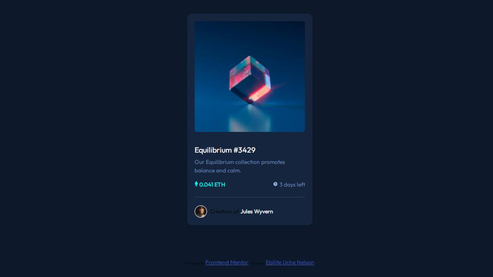

# Frontend Mentor - NFT preview card component solution


## Table of contents

- [Overview](#overview)
  - [The challenge](#the-challenge)
  - [Screenshot](#screenshot)
  - [Links](#links)
  - [Built with](#built-with)
  - [What I learned](#what-i-learned)
  - [Continued development](#continued-development)
  - [Author](#author)
- [Acknowledgments](#acknowledgments)

**Note: Delete this note and update the table of contents based on what sections you keep.**

## Overview
 
 This is a solution to the [NFT preview card component challenge on Frontend Mentor](https://www.frontendmentor.io/challenges/nft-preview-card-component-SbdUL_w0U). Frontend Mentor challenges help you improve your coding skills by building realistic projects. 

 
### The challenge

Users should be able to:

- View the optimal layout depending on their device's screen size
- See hover states for interactive elements

### Screenshot


Below is the screenshot link to preview the Exercise





### Links

- Solution URL: (https://github.com/EBILITE/Nft_Preview_Card_Component.git)
- Live Site URL: [Add live site URL here](https://your-live-site-url.com)


### Built with

- Semantic HTML5 markup
- CSS custom properties
- Flexbox
- CSS Grid
- Mobile-first workflow


### What I learned

During this challeenge i run into few  confusing concepts and had to start afresh few times to get it right.

some of the problem where:

1. To hover over an imge to get an after event. the code is shown below:
```css
.img::after{
    content: url(./images/icon-view.svg);
    background: hsl(178, 100%, 50%, 0.5);
    display: flex;
    justify-content: center;
    align-items: center;
    inset: 0;
    transition: all 0.2s ease;
    opacity: 0;
    position: absolute;
}
```

2. Being able to play with the border to create an horizontal line without using the hr  syntax in html
```css
.component{
    padding: 23px 0;
    border-bottom: 1px solid hsl(215, 32%, 27%);
    margin-bottom: 15px;
}
```
Am so happy for this improvement.


### Continued development

In the near future i wish to learn more about css and to use it to build amazing projects.


## Author

- Github - (https://github.com/EBILITE)
- Frontend Mentor - [@EBILITE](https://www.frontendmentor.io/profile/EBILITE)
- Twitter - [@EbilitN](https://www.twitter.com/EbiliteN)


## Acknowledgments

I wish to acknowledge https://github.com/codewithsadee/ from whose github link i got to saw how, to implement some hover, affect, and border effects 


